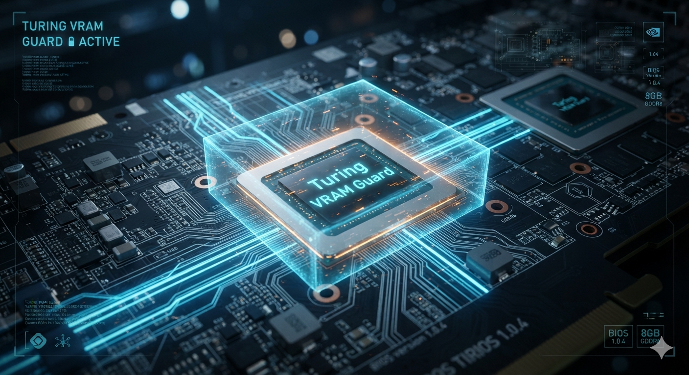

# Turing VRAM Guard

**How we debugged 32 CUDA builds, found a dead GDDR6 chip, and saved a Quadro RTX 6000 with a 64 MB software memory guard.**



[](https://forums.developer.nvidia.com/t/turing-sm_75-fp16-tensor-core-corruption-root-cause-gddr6-defect/376994)
[](LICENSE)

## The Problem

**Symptom:** Language models running on a Quadro RTX 6000 (Turing sm_75, 24 GB) produced garbled, nonsensical output. BPE tokenizers produced garbage. SentencePiece tokenizers produced garbage. Same model, same binary worked perfectly on an RTX 3070 Ti (Ampere sm_86).

**Red herring:** The tokenizer correlation. BPE and SentencePiece models stress different allocation patterns, so only some runs placed hot data on the bad region. Chasing the tokenizer meant chasing a shadow.

**Root cause:** **GDDR6 chip #16 on the Quadro RTX 6000 has stuck-at-0 cells** at ~1.719 GB physical address. Any CUDA allocation landing on this region silently returns corrupted data.

## How We Found It

| Step | What | Result |
|---|---|---|
| 1 | Same binary + model on second GPU | Clean on 3070 Ti, garbage on Quadro → hardware |
| 2 | `nvidia-smi -q -d ECC` | **259 DRAM Uncorrectable errors** — conclusive |
| 3 | Cross-backend (CUDA + Vulkan) | Both fail on Quadro → confirms hardware |
| 4 | `vram_mapper_detailed` (custom tool) | **12,909 word errors** at chunk #55 (1.719 GB) |
| 5 | OCCT VRAM stress test | **604,057 errors** in 30 minutes |
| 6 | Walking-bit pattern test | **Stuck-at-0** cells confirmed |
| 7 | Granularity sweep (32→16→8→4 MB) | Defect localizes to **~8 MB at 1.719 GB** |
| 8 | L2 cache floor identified | 4 MB tests fail — TU102 has **6 MB L2 cache** |

**Key lesson:** Check ECC before anything else. `nvidia-smi -q -d ECC` would have saved us 30 of those 32 builds.

## The Fix

A **~200-line patch** in `ggml_cuda_init()` (llama.cpp's CUDA backend):

1. Detects Turing sm_75 GPU at startup
2. Allocates **~370 chunks of 64 MB each** (init mode, guaranteed L2 eviction)
3. Tests each chunk with fill→sync→check kernels
4. Finds the bad chunk and keeps it + 1 neighbor (**128 MB total** reserved)
5. Frees all clean chunks — CUDA allocator never touches the bad region

Also includes a **rescan mode** (`ggml_cuda_guard_rescan()`) that uses 8 MB chunks
for recovery when VRAM is partially occupied — reserves 24 MB total in that path.

**Result:** Lexi 8B Q5_K_M works perfectly. Clean output on every inference.

### Features

- **64 MB init / 8 MB rescan granularity** — largest safe size for init (10× TU102 L2), 8 MB for recovery when VRAM is full
- **±1 neighbor guard** — 128 MB init / 24 MB rescan reserved; 23.6 GB usable at init
- **Boot-drift immune** — rescans at every `ggml_cuda_init()` call
- **Canary thread** — `ggml_cuda_guard_verify()` detects WDDM eviction
- **Self-healing** — `ggml_cuda_guard_rescan()` re-scans and re-guards without restart

## What Didn't Work

We spent 48+ hours trying to use **CUDA Virtual Memory Management** (`cuMemCreate`) for a global page-level quarantine (Strategy B). Conclusion: on WDDM/Turing, `cuMemCreate` allocates from a different physical pool than `cudaMalloc` — the defective chip is never exposed through VMM handles. This appears to be a WDDM-specific limitation; Linux behavior may differ.

For the full postmortem, see [docs/vmm-postmortem.md](docs/vmm-postmortem.md).

## Quick Start

### 1. Diagnose your GPU

```powershell
# Check ECC first — this alone may be conclusive
nvidia-smi -i <GPU_ID> -q -d ECC

# Run the memory mapper (included in tools/)
vram_mapper_detailed.exe 8 3 <GPU_ID>
# Look for: [BAD ] chunk ### | offset ~ X.XXX GB | errors=N
```

### 2. Apply the guard to llama.cpp

```bash
cd llama.cpp
git apply ggml-cuda.patch
cmake --build build_cublas --target ggml-cuda --config Release -j 4
```

### 3. Deploy (LM Studio)

```powershell
copy build_cublas\bin\ggml-cuda.dll <LM_STUDIO_BACKEND_PATH>\ggml-cuda.dll
```

The guard runs automatically on startup for any Turing sm_75 GPU. Look for `[VRAM] Guard: 128 MB reserved` in logs (64 MB init mode).

### 4. Canary (optional)

Call `ggml_cuda_guard_verify(device_id)` before inference to detect WDDM eviction. If the guard is compromised, unload model buffers, call `ggml_cuda_guard_rescan(device_id)`, and reload.

## Repository Structure

```
turing-vram-guard/
├── README.md                          ← This file
├── ggml-cuda.patch                    ← The fix for llama.cpp
├── LICENSE
├── tools/
│   ├── vram_mapper_detailed.cu        ← VRAM scanner (the tool that found it)
│   └── vmm_probe.cu                   ← VMM validation (proof cuMemCreate doesn't work)
└── docs/
    ├── nvidia-forum.md                ← NVIDIA Developer Forum post + official response
    ├── ecc-analysis.md                ← Why ECC ON crashes, why ECC OFF + guard works
    └── vmm-postmortem.md              ← 48h of VMM debugging (L2 cache, TLB, scratch VA)
```

## NVIDIA Developer Forum

Our findings were confirmed by NVIDIA staff on the developer forums. The official response validated our diagnostic methodology and confirmed the ECC counter as the definitive evidence. See [docs/nvidia-forum.md](docs/nvidia-forum.md) for the full exchange.

## Hardware Details

- **GPU:** Quadro RTX 6000 (TU102, Turing sm_75, 24 GB GDDR6)
- **Defect:** Chip #16, stuck-at-0 cells at 1.719 GB physical
- **ECC:** 259 DRAM Uncorrectable (multi-bit, cannot correct)
- **L2 cache:** 6 MB (defines minimum detectable chunk size)
- **OS:** Windows 10, WDDM, CUDA 12.4

## Status

- ✅ LM Studio / llama.cpp: **SOLVED** — ggml-cuda.cu guard
- ❌ ComfyUI / PyTorch: **NOT SOLVED** — cudaMalloc guard doesn't protect PyTorch (WDDM VA→PA mismatch)
- ❌ VMM / cuMemCreate: **DEAD END** on WDDM — different physical pool
- 🔄 DPR (Dynamic Page Retirement): **UNTESTED** — ~4 MB cap may not cover full defect

## License

MIT — use it, fork it, ship it. If this saves your GPU, a star ⭐ is appreciated.
